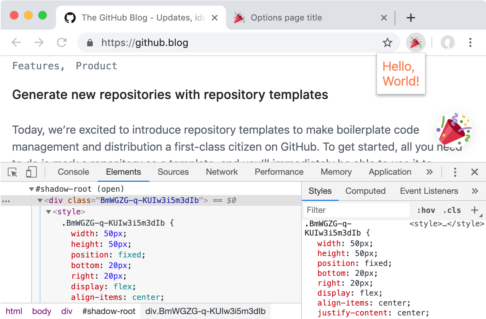

## 🎉 React (Preact) Browser Extension Boilerplate

- **Preact X** (or React if you prefer it)
- **Shadow DOM** for injected content
- **CSS Modules**
- **PostCSS** (preset-env and custom-properties)
- **Auto reloading**
- Ready-to-go setup with **internationalization**

This project aims to provide a simple boilerplate for writing browser extensions for the most popular browsers, such as Chrome, Firefox, and Opera.

It's built with `preact` and `preact-compat` which allows you to switch between `react` and `preact`.

Content and styles which are injected directly to the page, are isolated inside Shadow DOM. CSS modules are used to avoid class names collision.

## Note on Content Security Policy (CSP)
"unsafe-eval" in directive 'script-src' is needed for auto reloading, and should be removed from production manifest.json.

#### Useful links

- [Manifest File Format](https://developer.chrome.com/apps/manifest)
- [Content Security Policy (CSP)](https://developer.chrome.com/extensions/contentSecurityPolicy)
- [Chrome i18n](https://developer.chrome.com/extensions/i18n)
- [Porting a Google Chrome extension to Firefox](https://developer.mozilla.org/en-US/docs/Mozilla/Add-ons/WebExtensions/Porting_a_Google_Chrome_extension)
- [Firefox add-ons examples](https://github.com/mdn/webextensions-examples)
- [exthouse - tool for performance testing](https://github.com/treosh/exthouse)
